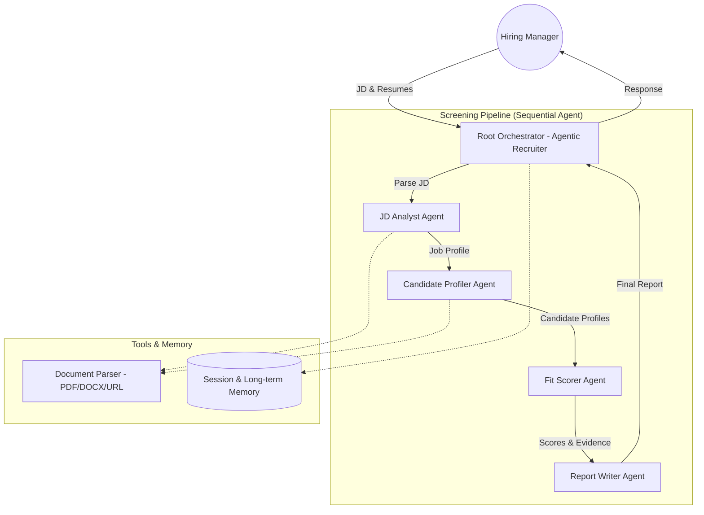

# Agentic Recruiter: Multi-Agent Resume Screener

**An intelligent, multi-agent system that automates the first pass of resume screening using the Google Agent Development Kit (ADK) and Gemini.**

---

## 🎯 Problem Statement

In high-volume hiring pipelines, the initial screening phase is often the biggest bottleneck. Recruiters face three core challenges:

1.  **Inconsistent Screening**: Different recruiters (or the same recruiter on different days) may evaluate candidates differently, leading to bias and noise.
2.  **Hidden Gaps**: Keyword matching misses the nuance. A candidate might match "Python" but lack the specific "real-time data processing" experience required for the role.
3.  **Slow Feedback**: Hiring managers need detailed reasons *why* a candidate is a fit or not, but generating detailed reports for every applicant is impossible at scale.

## 💡 Solution

**Agentic Recruiter** is not just a chatbot; it's a structured **multi-agent workflow** designed to replicate the reasoning process of a human recruiter. Instead of a single "pass/fail", it produces:

*   Structured profiles for both the Job Description (JD) and Candidates.
*   A defensible, evidence-based fit score (0-100).
*   A recruiter-ready report with interview focus areas.

It leverages **Google's Agent Development Kit (ADK)** to manage state, tools, and memory, ensuring a robust and observable pipeline.

## 🏗️ Architecture

The system is composed of five specialized agents orchestrated to perform a sequential screening workflow.



### The Agent Team

| Agent | Role | Model | Tools |
| :--- | :--- | :--- | :--- |
| **JD Analyst** | Parses job descriptions into structured requirements (skills, seniority, constraints). | Gemini 2.5 Flash-Lite | `extract_job_profile`, `parse_document` |
| **Candidate Profiler** | Extracts structured data from resumes (experience, skills, education). | Gemini 2.5 Flash-Lite | `extract_candidate_profile`, `parse_document` |
| **Fit Scorer** | Compares structured JD and Candidate profiles to compute a weighted score. | **Gemini 2.5 Flash** (Stronger reasoning) | `compute_fit_score` |
| **Report Writer** | Synthesizes scores into a ranked markdown table and summary. | Gemini 2.5 Flash-Lite | None (Synthesis only) |
| **Root Orchestrator** | Manages the user conversation, routes tasks, and handles memory. | Gemini 2.5 Flash | All sub-agents, `load_memory` |

## ✨ Key Features

*   **Multi-Format Ingestion**: Handles raw text, URLs, PDFs, and DOCX files automatically.
*   **Structured Reasoning**: Uses JSON schemas to force the LLM to be rigorous about data extraction (vs. free-form hallucination).
*   **Long-Term Memory**: Remembers hiring preferences and past roles across sessions using ADK's `MemoryService`.
*   **Observability**: Integrated `LoggingPlugin` tracks every agent thought and tool call.
*   **Evaluation**: Includes a built-in evaluation set (`evalset.json`) to measure relevance, accuracy, and helpfulness using `adk eval`.

## 🚀 Setup & Installation

### Prerequisites

*   Python 3.10+
*   Google Cloud Project with Vertex AI API enabled.
*   [Google Cloud SDK](https://cloud.google.com/sdk/docs/install) installed and authenticated.

### Installation

1.  **Clone the repository**:
    
    ```bash
    git clone https://github.com/sobhanb-eth/agentic-recruiter.git
    cd agentic-recruiter
    ```
    
2.  **Install dependencies**:
    ```bash
    pip install google-adk google-cloud-aiplatform PyPDF2 python-docx requests
    ```

3.  **Configure Environment**:
    Create a `.env` file or set environment variables:
    ```bash
    export GOOGLE_CLOUD_PROJECT="your-project-id"
    export GOOGLE_CLOUD_LOCATION="us-central1"
    export GOOGLE_API_KEY="your-api-key" # Optional, if using API key auth
    ```

## 📖 Usage

### Running the Notebook
The core logic is contained in `Agentic-Recruiter.ipynb`. You can run this in:
*   **Kaggle Notebooks**: (Recommended) Use the "Google Cloud SDK" add-on for easy auth.
*   **Local Jupyter**: Ensure you have `gcloud auth application-default login` set up.

### Interactive Chat
The notebook provides a `chat()` helper function to interact with the agent.

```python
# Start a session
await chat("Hello! I have a new role to screen for.", session_id="hiring_session_1")

# Provide JD
await chat("Here is the JD: https://company.com/careers/senior-ml-engineer", session_id="hiring_session_1")

# Provide Resumes
await chat("Here is the first resume: ...", session_id="hiring_session_1")

# Get Results
await chat("Please rank the candidates.", session_id="hiring_session_1")
```

### Running Evaluations
To verify the agent's performance against the defined test cases:

```bash
adk eval resume_agent evalset.json --config_file_path=test_config.json
```

## 🛠️ Technical Details

### Document Parsing
The `parse_document` tool acts as a smart router. It detects the input type (URL vs. Text) and file format (PDF vs. DOCX) to apply the correct extraction logic (`PyPDF2` or `python-docx`) before passing clean text to the LLM.

### Memory Architecture
*   **Short-term**: `DatabaseSessionService` (SQLite) persists the immediate conversation state.
*   **Long-term**: `VertexAiMemoryBankService` (in production) or `InMemoryMemoryService` (dev) stores high-level summaries (e.g., "User prefers candidates with Fintech background") to personalize future interactions.

## ☁️ Deployment

This agent is ready for deployment on **Vertex AI Agent Engine**.

1.  Organize code into a `resume_agent/` directory.
2.  Define `agent_engine_config.json`.
3.  Deploy with ADK CLI:
    ```bash
    adk deploy agent_engine \
        --project=$PROJECT_ID \
        --region=$LOCATION \
        resume_agent/
    ```

---

*Built with ❤️ using Google ADK and Gemini.*
